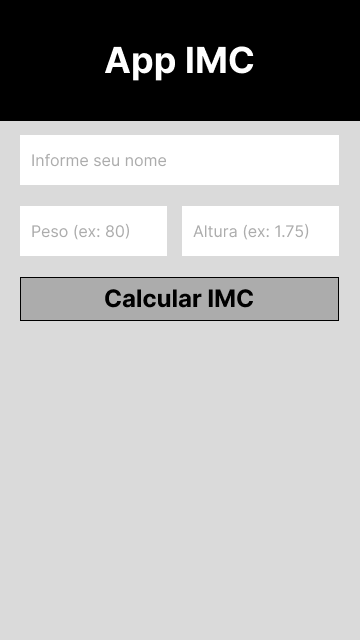
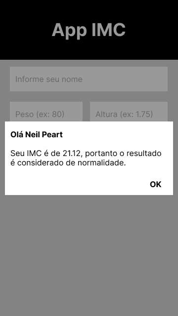

# Exercício React Native com Expo - Orientações

## Aplicativo para cálculo e verificação de IMC

---

### Estrutura geral e estilos

Você deverá usar componentes como `SafeAreaView`, `StatusBar`, `View`, `Text`, `TextInput`, `Button` (ou `Pressable`).

A estilização não precisa ser muito elaborada, basta o necessário para uma boa visualização e usabilidade.

---

### Lógica do aplicativo

Devem ser capturados através de campos de formulário e botão o nome da pessoa, seu peso e altura.

Você deverá usar `states`, funções e eventos para poder manipular a entrada, processamento e saída dos dados do formulário na tela.

Para o cálculo do IMC, utilize a fórmula: `peso / (altura * altura)`.

A lógica condicional para determinar os resultados de acordo com o IMC calculado, deve ser:

- IMC **menor que 18.5**: situação de magreza
- IMC **maior ou igual a 18.5 e menor que 25**: situação de normalidade
- IMC **maior ou igual a 25 e menor que 30**: situação de sobrepeso
- IMC **maior ou igual a 30 e menor que 40**: situação de obesidade
- IMC **maior ou igual a 40**: situação de obesidade grave

---

### Exibição dos resultados

Após o preenchimento dos campos, acionamento do botão e cálculos/verificações, seu aplicativo deve mostrar de alguma forma o nome da pessoa, seu IMC e sua situação.

_Sugestão de UI para entrada e saída dos dados do seu app:_

 
